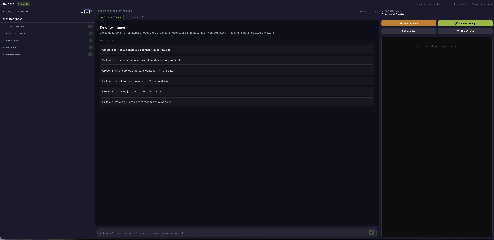

# AEM Train-Me

An AI-powered interactive training platform for Adobe Experience Manager (AEM) developers.  
Ask the AI trainer to build any AEM feature — it writes the code, explains every file, and deploys it to a live AEM instance running right alongside the app.

---

## What It Does

Trainees interact with an AI assistant that acts as a senior AEM architect. Instead of just explaining concepts, it generates **complete, deployable AEM code** in response to natural language requests:

> *"Create a card component with a title, description, image, and CTA link"*  
> *"Build an OSGi service that fetches data from an external REST API"*  
> *"Create a Sling Scheduler that runs every hour and logs a summary"*

The AI writes all the files (HTL templates, Sling Models, OSGi configs, dialog XMLs, test pages), deploys them to AEM via Maven, and explains what each file does and why.

---

## Features

- **AI Code Generation** — Generates complete AEM components, servlets, services, filters, schedulers, workflow steps, and more
- **Live AEM Instance** — A real AEM 6.5 Author runs inside the same Docker container — no separate setup needed
- **One-Command Setup** — Trainees just run `docker-compose up` and open a browser
- **Project Scaffolding** — Generates a fresh Maven AEM project via the Adobe archetype on first use
- **Build & Deploy** — Runs `mvn clean install` and deploys packages to AEM with one click
- **Project Explorer** — Browse generated source files grouped by AEM category: components, Sling models, servlets, services, filters, unit tests, integration tests, OSGi configs, clientlibs, frontend, content, and conf (templates/policies). Folders start collapsed so large component sets stay navigable.
- **Console Output** — Real-time Maven build logs streamed to the browser with per-line severity colouring (errors in red, warnings in yellow). One-click **Clear Output** and a live **Tail error.log** toggle that streams AEM's `error.log` straight into the console via SSE.
- **Chat History** — All conversations are saved and resumable across sessions
- **Dual Modes** — "Deloitte Trainer" mode (generates code) and "General AEM" mode (educational Q&A)

---

## Quick Start

> For full prerequisites and detailed instructions see [SETUP.md](SETUP.md).

**Step 1** — Install [Docker Desktop](https://www.docker.com/products/docker-desktop/) and set memory to **8 GB+**  
(Docker Desktop → Settings → Resources → Memory)

**Step 2** — Place your AEM files in the `aem/` directory:
```
aem/
├── aem-quickstart.jar      ← AEM 6.5 quickstart jar (from Adobe)
└── license.properties      ← AEM licence file (from Adobe portal)
```

**Step 3** — Build the Docker image (one-time, ~20 min):
```bash
docker build -t aem-train-me .
```

**Step 4** — Start everything:
```bash
AI_API_KEY=your-openai-or-anthropic-key docker-compose up -d
```

**Step 5** — Wait ~3–5 minutes for AEM to initialise on first boot, then open:

| | URL |
|-|-----|
| **Train-Me App** | http://localhost:3000 |
| **AEM Author** | http://localhost:4502 &nbsp;(admin / admin) |

Watch startup progress: `docker logs -f aem-train-me`

---

## AI Provider

The app supports **OpenAI** and **Anthropic** as AI providers.

| Provider | Key prefix | Recommended model |
|----------|-----------|-------------------|
| OpenAI (default) | `sk-...` | `gpt-4` |
| Anthropic | `sk-ant-...` | `claude-opus-4-6` |

Get an OpenAI key at https://platform.openai.com/api-keys  
Get an Anthropic key at https://console.anthropic.com

> Note: Both require a separate API account with pay-as-you-go billing, independent of any Claude.ai or ChatGPT subscription.

To use Anthropic:
```bash
AI_API_KEY=sk-ant-... AI_PROVIDER=anthropic AI_MODEL=claude-opus-4-6 docker-compose up -d
```

---

## Architecture

```
┌─────────────────────────────────────────────────────┐
│                  Docker Container                    │
│                                                      │
│  ┌─────────────┐   ┌─────────────┐   ┌───────────┐  │
│  │  Next.js    │   │  Express    │   │  AEM 6.5  │  │
│  │  Frontend   │──▶│  Backend    │──▶│  Author   │  │
│  │  :3000      │   │  :3001      │   │  :4502    │  │
│  └─────────────┘   └──────┬──────┘   └───────────┘  │
│                           │                          │
│                    ┌──────▼──────┐                   │
│                    │  OpenAI /   │                   │
│                    │  Anthropic  │                   │
│                    │  API        │                   │
│                    └─────────────┘                   │
│                                                      │
│  JDK 21 · Maven 3.9 · Node.js 20 · SQLite           │
└─────────────────────────────────────────────────────┘
```

- **Frontend** (Next.js 14) — Three-panel UI: file explorer, AI chat, command centre
- **Backend** (Express + TypeScript) — REST API, SSE streaming, AI tool execution, Maven orchestration
- **AEM** — Runs as a background process; receives deployments via Package Manager
- **SQLite** — Stores chat sessions and message history

---

## Project Structure

```
aem-train-me/
├── frontend/          # Next.js UI
├── backend/           # Express API server
│   └── src/
│       ├── routes/    # API endpoints (chat, build, files, project, aem)
│       ├── services/  # AI agent, build engine, AEM client, file manager
│       └── tools/     # AI tool definitions (write_file, read_file, etc.)
├── prompts/           # System prompt for the AI trainer
├── aem-projects/      # Generated AEM Maven projects (runtime, gitignored)
├── aem/               # AEM jar + license (you provide these, gitignored)
├── docker/
│   └── startup.sh     # Container startup orchestration script
├── Dockerfile
├── docker-compose.yml
├── .env.example       # Environment variable template
└── SETUP.md           # Detailed setup and operations guide
```

---

## Stopping & Data Persistence

```bash
# Stop (all data preserved)
docker-compose down

# Stop and wipe all data (fresh slate — AEM re-initialises on next boot)
docker-compose down -v
```

AEM repository data and generated projects are stored in Docker named volumes and survive image rebuilds and container restarts. See [SETUP.md — Data Persistence](SETUP.md#data-persistence) for details.

---

## Troubleshooting

See [SETUP.md — Troubleshooting](SETUP.md#troubleshooting) for solutions to common issues including Java path errors, Maven version errors, and AEM Core Components not rendering.

## Screenshot


